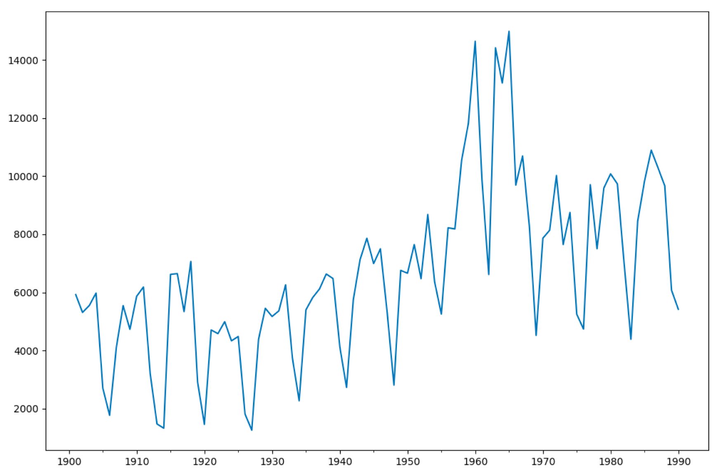
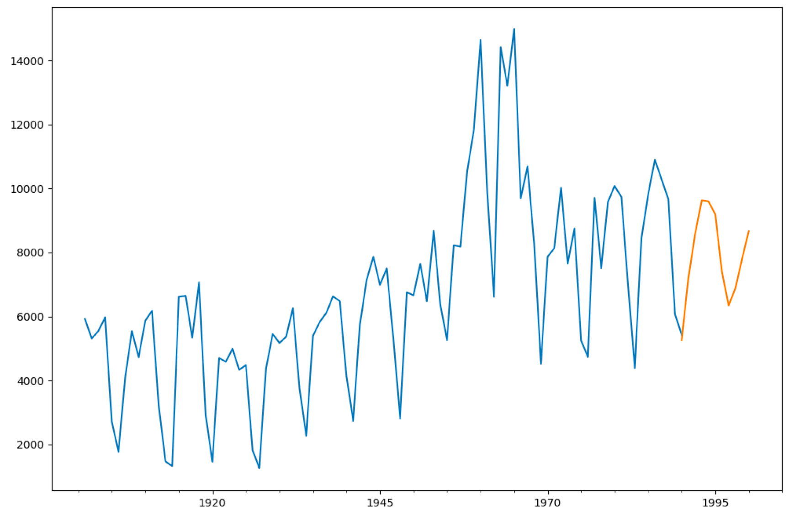
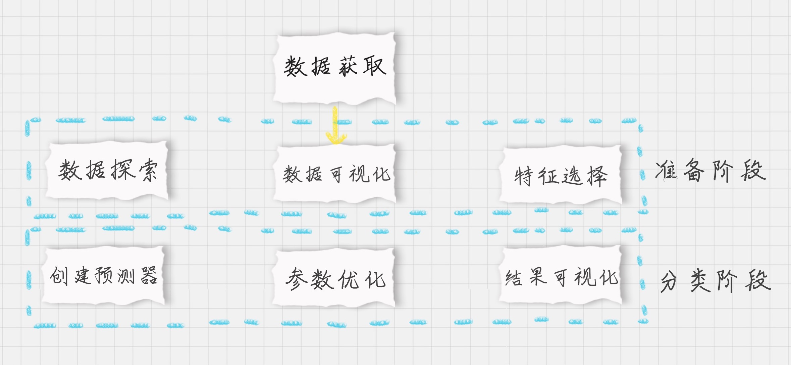
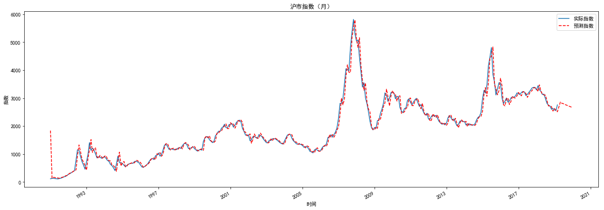

# 如何对沪市指数走势进行预测？


用数据挖掘对沪市指数的走势进行预测和分析。

了解时间序列预测的概念，以及常用的模型算法，包括 AR、MA、ARMA、ARIMA 模型等；

掌握并使用 ARMA 模型工具，对一个时间序列数据进行建模和预测；

对沪市指数的历史数据进行时间序列建模，并预测未来 10个月的走势。

## 时间序列预测

关于时间序列，你可以把它理解为按照时间顺序组成的数字序列。实际上在中国古代的农业社会中，人们就将一年中不同时间节点和天气的规律总结了下来，形成了二十四节气，也就是从时间序列中观察天气和太阳的规律（只是当时没有时间序列模型和相应工具），从而使得农业得到迅速发展。在现代社会，时间序列在金融、经济、商业领域拥有广泛的应用。

在时间序列预测模型中，有一些经典的模型，包括 AR、MA、ARMA、ARIMA。我来给你简单介绍一下。

AR 的英文全称叫做 Auto Regressive，中文叫自回归模型。这个算法的思想比较简单，它认为过去若干时刻的点通过线性组合，再加上白噪声就可以预测未来某个时刻的点。

在我们日常生活环境中就存在白噪声，在数据挖掘的过程中，你可以把它理解为一个期望为 0，方差为常数的纯随机过程。AR 模型还存在一个阶数，称为 AR（p）模型，也叫作 p 阶自回归模型。它指的是通过这个时刻点的前 p 个点，通过线性组合再加上白噪声来预测当前时刻点的值。

MA 的英文全称叫做 Moving Average，中文叫做滑动平均模型。它与 AR 模型大同小异，AR 模型是历史时序值的线性组合，MA 是通过历史白噪声进行线性组合来影响当前时刻点。AR 模型中的历史白噪声是通过影响历史时序值，从而间接影响到当前时刻点的预测值。同样 MA 模型也存在一个阶数，称为 MA(q) 模型，也叫作 q 阶移动平均模型。我们能看到 AR 和 MA 模型都存在阶数，在 AR 模型中，我们用 p 表示，在 MA 模型中我们用 q 表示，这两个模型大同小异，与 AR 模型不同的是 MA 模型是历史白噪声的线性组合。

ARMA 的英文全称是 Auto Regressive Moving Average，中文叫做自回归滑动平均模型，也就是 AR 模型和 MA 模型的混合。相比 AR 模型和 MA 模型，它有更准确的估计。同样 ARMA 模型存在 p 和 q 两个阶数，称为 ARMA(p,q) 模型。

ARIMA 的英文全称是 Auto Regressive Integrated Moving Average 模型，中文叫差分自回归滑动平均模型，也叫求合自回归滑动平均模型。相比于 ARMA，ARIMA 多了一个差分的过程，作用是对不平稳数据进行差分平稳，在差分平稳后再进行建模。ARIMA 的原理和 ARMA 模型一样。相比于 ARMA(p,q) 的两个阶数，ARIMA 是一个三元组的阶数 (p,d,q)，称为 ARIMA(p,d,q) 模型。其中 d 是差分阶数。

## ARMA 模型工具


在使用 ARMA 工具前，你需要先引用相关工具包：


```from statsmodels.tsa.arima_model import ARMA```

然后通过 `ARMA(endog,order,exog=None) `创建 ARMA 类，这里有一些主要的参数简单说明下：

endog：英文是` endogenous variable`，代表内生变量，又叫非政策性变量，它是由模型决定的，不被政策左右，可以说是我们想要分析的变量，或者说是我们这次项目中需要用到的变量。

order：代表是 p 和 q 的值，也就是 ARMA 中的阶数。

exog：英文是 exogenous variables，代表外生变量。外生变量和内生变量一样是经济模型中的两个重要变量。相对于内生变量而言，外生变量又称作为政策性变量，在经济机制内受外部因素的影响，不是我们模型要研究的变量。

举个例子，如果我们想要创建 ARMA(7,0) 模型，可以写成：ARMA(data,(7,0))，其中 data 是我们想要观察的变量，(7,0) 代表 (p,q) 的阶数。

创建好之后，我们可以通过 fit 函数进行拟合，通过 predict(start, end) 函数进行预测，其中 start 为预测的起始时间，end 为预测的终止时间。

下面我们使用 ARMA 模型对一组时间序列做建模，代码如下：

```python
# coding:utf-8

# 用ARMA进行时间序列预测

import pandas as pd

import matplotlib.pyplot as plt

import statsmodels.api as sm

from statsmodels.tsa.arima_model import ARMA

from statsmodels.graphics.api import qqplot

# 创建数据

data = [5922, 5308, 5546, 5975, 2704, 1767, 4111, 5542, 4726, 5866, 6183, 3199, 1471, 1325, 6618, 6644, 5337, 7064, 2912, 1456, 4705, 4579, 4990, 4331, 4481, 1813, 1258, 4383, 5451, 5169, 5362, 6259, 3743, 2268, 5397, 5821, 6115, 6631, 6474, 4134, 2728, 5753, 7130, 7860, 6991, 7499, 5301, 2808, 6755, 6658, 7644, 6472, 8680, 6366, 5252, 8223, 8181, 10548, 11823, 14640, 9873, 6613, 14415, 13204, 14982, 9690, 10693, 8276, 4519, 7865, 8137, 10022, 7646, 8749, 5246, 4736, 9705, 7501, 9587, 10078, 9732, 6986, 4385, 8451, 9815, 10894, 10287, 9666, 6072, 5418]

data=pd.Series(data)

data_index = sm.tsa.datetools.dates_from_range('1901','1990')

# 绘制数据图

data.index = pd.Index(data_index)

data.plot(figsize=(12,8))

plt.show()

# 创建ARMA模型# 创建ARMA模型

arma = ARMA(data,(7,0)).fit()

print('AIC: %0.4lf' %arma.aic)

# 模型预测

predict_y = arma.predict('1990', '2000')

# 预测结果绘制

fig, ax = plt.subplots(figsize=(12, 8))

ax = data.ix['1901':].plot(ax=ax)

predict_y.plot(ax=ax)

plt.show()

```


运行结果：

`AIC: 1619.6323`





我创建了 1901 年 -1990 年之间的时间序列数据 data，然后创建 ARMA(7,0) 模型，并传入时间序列数据 data，使用 fit 函数拟合，然后对 1990 年 -2000 年之间的数据进行预测，最后绘制预测结果。

你能看到 ARMA 工具的使用还是很方便的，只是我们需要 p 和 q 的取值。实际项目中，我们可以给 p 和 q 指定一个范围，让 ARMA 都运行一下，然后选择最适合的模型。

怎么判断一个模型是否适合？

我们需要引入 AIC 准则，也叫作赤池消息准则，它是衡量统计模型拟合好坏的一个标准，数值越小代表模型拟合得越好。

在这个例子中，你能看到 ARMA(7,0) 这个模型拟合出来的 AIC 是 1619.6323（并不一定是最优）。

## 对沪市指数进行预测

我们都知道沪市指数的走势除了和历史数据以外，还和很多外界因素相关，比如用户的关注度，各国的政策，币圈之间是否打架等等。当然这些外界的因素不是我们这节课需要考虑的对象。

假设我们只考虑沪市指数以往的历史数据，用 ARMA 这个时间序列模型预测沪市指数的走势。

沪市指数历史数据（从1990-12-19到2019-2-28）

你能看到数据一共包括了 8 个字段，代表的含义如下：

我们的目标是构造 ARMA 时间序列模型，预测沪市指数（平均）价格走势。p 和 q 参数具体选择多少呢？我们可以设置一个区间范围，然后选择 AIC 最低的 ARMA 模型。

我们梳理下整个项目的流程：

 

首先我们需要加载数据。

在准备阶段，我们需要先探索数据，采用数据可视化方式查看沪市指数的历史走势。按照不同的时间尺度（天，月，季度，年）可以将数据压缩，得到不同尺度的数据，然后做可视化呈现。这 4 个时间尺度上，我们选择月作为预测模型的时间尺度，相应的，我们选择 Weighted_Price 这个字段的数值作为观察结果，在原始数据中，Weighted_Price 对应的是沪市指数每天的平均价格，当我们以“月”为单位进行压缩的时候，对应的 Weighted_Price 得到的就是当月的沪市指数平均价格。压缩代码如下：

`df_month = df.resample('M').mean()`

最后在预测阶段创建 ARMA 时间序列模型。我们并不知道 p 和 q 取什么值时，模型最优，因此我们可以给它们设置一个区间范围，比如都是 range(0,3)，然后计算不同模型的 AIC 数值，选择最小的 AIC 数值对应的那个 ARMA 模型。最后用这个最优的 ARMA 模型预测未来 8 个月的沪市指数平均价格走势，并将结果做可视化呈现。

基于这个流程，具体代码如下：

```python
# -*- coding: utf-8 -*-
# 沪市指数走势预测，使用时间序列ARMA
import numpy as np
import pandas as pd
import matplotlib.pyplot as plt
from statsmodels.tsa.arima_model import ARMA
import warnings
from itertools import product
from datetime import datetime
warnings.filterwarnings('ignore')
# 数据加载
df = pd.read_csv('./shanghai_1990-12-19_to_2019-2-28.csv')
# 将时间作为df的索引
df.Timestamp = pd.to_datetime(df.Timestamp)
df.index = df.Timestamp
# 数据探索
# print(df.head())
# 按照月，季度，年来统计
df_month = df.resample('M').mean()


# 设置参数范围
ps = range(0, 3)
qs = range(0, 3)
parameters = product(ps, qs)
parameters_list = list(parameters)
# 寻找最优ARMA模型参数，即best_aic最小
results = []
best_aic = float("inf") # 正无穷
for param in parameters_list:
    try:
        model = ARMA(df_month.Price,order=(param[0], param[1])).fit()
    except ValueError:
        print('参数错误:', param)
        continue
    aic = model.aic
    if aic < best_aic:
        best_model = model
        best_aic = aic
        best_param = param
    results.append([param, model.aic])
# 输出最优模型
result_table = pd.DataFrame(results)
result_table.columns = ['parameters', 'aic']
print('最优模型: ', best_model.summary())
# A股预测
df_month2 = df_month[['Price']]
date_list = [datetime(2019, 4, 30), datetime(2019, 5, 31), datetime(2019, 6, 30), datetime(2019, 7, 31), datetime(2019, 8, 31), 
             datetime(2019, 9, 30), datetime(2019, 10, 31), datetime(2019, 11, 30), datetime(2019, 12, 31)]
future = pd.DataFrame(index=date_list, columns= df_month.columns)
df_month2 = pd.concat([df_month2, future])
df_month2['forecast'] = best_model.predict(start=0, end=348)

print(df_month2)

# 预测结果显示
plt.figure(figsize=(20,7))
df_month2.Price.plot(label='实际指数')
df_month2.forecast.plot(color='r', ls='--', label='预测指数')
plt.legend()
plt.title('沪市指数（月）')
plt.xlabel('时间')
plt.ylabel('指数')
plt.show()

```


运行结果：

```
参数错误: (0, 2)
最优模型:                                ARMA Model Results                              
==============================================================================
Dep. Variable:                  Price   No. Observations:                  339
Model:                     ARMA(2, 2)   Log Likelihood               -2208.110
Method:                       css-mle   S.D. of innovations            162.159
Date:                Tue, 18 Feb 2020   AIC                           4428.219
Time:                        13:49:50   BIC                           4451.175
Sample:                    12-31-1990   HQIC                          4437.367
                         - 02-28-2019                                         
===============================================================================
                  coef    std err          z      P>|z|      [0.025      0.975]
-------------------------------------------------------------------------------
const        1839.2500    489.792      3.755      0.000     879.276    2799.224
ar.L1.Price     0.5137      0.130      3.959      0.000       0.259       0.768
ar.L2.Price     0.4501      0.128      3.508      0.001       0.199       0.702
ma.L1.Price     0.8480      0.121      6.985      0.000       0.610       1.086
ma.L2.Price     0.3796      0.062      6.095      0.000       0.258       0.502
                                    Roots                                    
=============================================================================
                 Real           Imaginary           Modulus         Frequency
-----------------------------------------------------------------------------
AR.1            1.0254           +0.0000j            1.0254            0.0000
AR.2           -2.1666           +0.0000j            2.1666            0.5000
MA.1           -1.1171           -1.1776j            1.6231           -0.3708
MA.2           -1.1171           +1.1776j            1.6231            0.3708
-----------------------------------------------------------------------------
                  Price     forecast
1990-12-31   116.285556  1839.250039
1991-01-31   132.367273   138.354224
1991-02-28   131.877778   167.903495
1991-03-31   126.002381   162.242839
1991-04-30   118.459091   147.479365
1991-05-31   109.845909   146.343931
1991-06-30   126.203000   134.442449
1991-07-31   137.276522   159.945778
1991-08-31   161.130000   171.455817
1991-09-30   185.636667   193.679757
1991-10-31   200.326190   223.621005
1991-11-30   239.680952   230.130766
1991-12-31   277.851818   279.024197
1992-01-31   305.415909   319.722497
1992-02-29   336.637647   335.857219
1992-03-31   375.535000   372.112954
1992-04-30   401.561364   414.116304
1992-05-31   774.864500   432.449884
1992-06-30  1153.947727   930.895826
1992-07-31  1133.045652  1327.192432
1992-08-31   909.018571  1087.997957
1992-09-30   731.690000   818.007400
1992-10-31   605.624000   710.401445
1992-11-30   460.667619   585.332907
1992-12-31   734.299130   430.245914
1993-01-31   998.293333   861.577782
1993-02-28  1410.444500  1141.193422
1993-03-31  1134.035652  1520.636526
1993-04-30  1208.723182  1058.297135
1993-05-31  1145.300476  1178.710472
                ...          ...
2017-06-30  3138.320791  3028.799207
2017-07-31  3213.061695  3133.333552
2017-08-31  3280.678770  3238.955742
2017-09-30  3361.502924  3263.798805
2017-10-31  3385.108594  3368.804463
2017-11-30  3386.266982  3369.533626
2017-12-31  3290.454552  3350.221759
2018-01-31  3447.459232  3236.811113
2018-02-28  3299.997613  3474.618648
2018-03-31  3242.813668  3245.464638
2018-04-30  3128.568661  3149.307274
2018-05-31  3145.073250  3114.811215
2018-06-30  2982.514060  3108.248139
2018-07-31  2815.662009  2919.237674
2018-08-31  2751.050691  2719.927012
2018-09-30  2715.988689  2734.265415
2018-10-31  2601.724211  2696.404486
2018-11-30  2630.934827  2538.379057
2018-12-31  2576.510435  2631.728969
2019-01-31  2555.663395  2562.672539
2019-02-28  2759.671400  2512.256447
2019-04-30          NaN  2862.477969
2019-05-31          NaN  2816.163865
2019-06-30          NaN  2801.710091
2019-07-31          NaN  2773.437184
2019-08-31          NaN  2752.406401
2019-09-30          NaN  2728.875648
2019-10-31          NaN  2707.320515
2019-11-30          NaN  2685.654995
2019-12-31          NaN  2664.822060

[348 rows x 2 columns]
```





我们通过 product 函数创建了 (p,q) 在 range(0,3) 范围内的所有可能组合，并对每个 ARMA(p,q) 模型进行了 AIC 数值计算，保存了 AIC 数值最小的模型参数。然后用这个模型对沪市指数的未来 10 个月进行了预测。

从结果中你能看到，在 2019 年 2 月之后 10 个月的时间里，沪市指数会触底到 2700左右。在时间尺度的选择上，我们选择了月，这样就对数据进行了降维，也节约了 ARMA 的模型训练时间。你能看到沪市指数这张图中，按月划分的沪市指数走势走势差别不大，在减少了局部的波动的同时也能体现出沪市指数的趋势，这样就节约了 ARMA 的模型训练时间。


